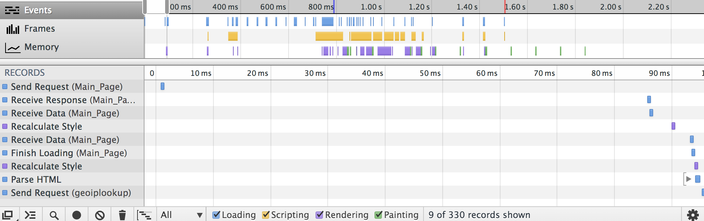

HW4 :: WebServer Responses
===========================

1. Using `telnet 127.0.0.1 $FLASK_PORT`
    1. What is the return code for `GET /home HTTP/1.1`?
        - Server Response Code was `200` `OK` which means it was a successful HTTP request i.e. the `client` requested for a resource and the `server` was able to locate the resource and then eventually serve the resource correctly, like here in a `telnet` session.
        

    2. What is the return code for `GET /wiki HTTP/1.1`?
        - The return code for the page is `302 FOUND`
        - `3XX` return codes are generally Redirection requests which means that the server responds with a redirect request with a `redirect location` for another resource, and hence the `Location` field in the server response. 
        - Since this is a telnet session I am not redirected to another page, but I see the response of the intermittent page which says `Redirecting...`
        - According to [MDN Docs](https://developer.mozilla.org/en-US/docs/HTTP/Response_codes), a `302` response was to be used to notify that __URI__ or the requested resource has been changed, but browsers these days have generally responded 
    3. What is the next HTTP statement a browser would send after this return code?
        - Since [en.wikipedia.org[(http://en.wikipedia.org)] is a different host, I would have to lookup the ip address of this host again, telnet there and then issue the GET request
        - In essence here are the steps:
            - `nslookup en.wikipedia.org`
            - `telnet 208.80.154.225 80`
            - `GET /home HTTP/1.1`

    4. What is the return code for `PUT /wiki HTTP/1.1`?
        - I get `200` Return code with `OK` return status meaning the operation was successful.
        - It says `Stored wiki => http://en.wikipedia.org`

2. Explain what happens when your browser loads `http://people.ischool.berkeley.edu/~shreyas/server/wiki` from sending the request to loading HTML
    - First the client (browser) sends a GET request for the URI. 
    - The server responds with a `302 FOUND` which means that the browser will have to redirect. The response has the URI of the new location as `http://en.wikipedia.org`
    - The client then makes a new GET request for `en.wikipedia.org`
    - The server then responds with a `301` request which intends to redirect the client to request the page at another location: `http://en.wikipedia.org/wiki/Main_Page`
    - The client then makes another GET request for `http://en.wikipedia.org/wiki/Main_Page`
    - Finally, the browser responds to this request with a `200` status with the response containing the html page
    - The browser then starts creating the DOM tree of the page as well as requesting the other resources referenced in the page like (`CSS`, `JS` files)

3. What is the return code for `http://people.ischool.berkeley.edu/~shreyas/server/` ?
    - The server responds with a `404` request describing `Resource NOT FOUND`.
    - Since there is no specific 404 page like a `404.html` the server responds with a generic `404` request. 